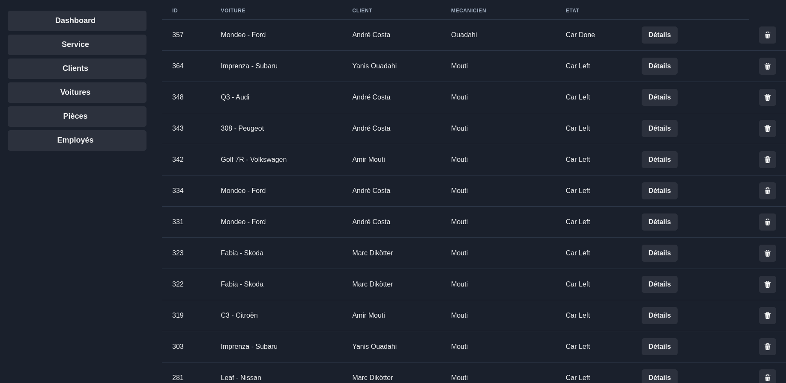

# dai-http-infrastructure

André Costa, Amir Mouti

# Introduction

This project groups two major semester projects for BDR and DAI.

This is mainly the reason you can see there are 3 contributors in the github page.

The DAI part of the project was exclusively implemented by André Costa and Amir Mouti.

Yanis Ouadahi only worked on the jdbc wrapper (database) interface

## BDR

For BDR the main goals were to create a database and interface with it

## DAI

For DAI the main goals can be found in the [original repo](https://github.com/HEIGVD-Course-DAI/dai-lab-http-infrastructure)

---

This readme documents the implementation that was done mainly for the DAI part of the project

# Build/ Deploy

## Setup Environnement

First, create a self-signed certificate so we can enable TLS

```bash
mkdir ssl
cd ssl
openssl req -x509 -newkey rsa:4096 -keyout key.pem -out cert.pem -sha256 -days 3650 -nodes -subj "/C=XX/ST=Vaud/L=Yverdon/O=HEIG-VD/OU=DAI/CN=localhost"
cd ..
```

Secondly, setup your environnement variables

```bash
echo "POSTGRESQL_USERNAME=jdbc
POSTGRESQL_PASSWORD=super_secret
POSTGRESQL_DATABASE=garage
POSTGRESQL_POSTGRES_PASSWORD=root
JDBC_DBMS=postgresql
JDBC_URL=database
JDBC_DATABASE_NAME=garage
JDBC_USER=jdbc
JDBC_PASSWORD=super_secret
JDBC_SCHEMA=garage" >> .env
```

Third: Launch and Build

```bash
docker compose up [-d]
```

For linux a setup script is available:

```bash
chmod +x setup
./setup
docker compose up [-d]
```

## Setup Database

Scripts in [this folder](./db_scripts/) can be used to create and insert values to the database.

### /!\ Database needs to be setup by user before any request is done to the backend /!\

You can now see the website [here](https://localhost)

Your browser will probably warn you that the connection is not safe, this is because the certificate is self-signed. You can ignore this error.

The website:



# Implementation

## Docker Compose

### Static FrontEnd

1. We start by defining the container-name and the image-name
2. For the building we can define a build directive, we set our context to the frontend folder and indicate the name of the dockerfile
3. Last but not least, we define the ports so that we can see the browser. This step is provisory, at the end of our implementation, we'll use the docker compose network directly and there won't be a need to expose any ports.

# Result


### Dynamic FrontEnd

Please check the frontend documentation [here](./garage-frontend/README.md)

### Rest API

Please check the backend documentation [here](./garage-backend/README.md)

### Reverse Proxy

For this project we use Traefik as our reverse proxy

#### Configuration Steps

1. Define a service in the docker-compose file with the traefik image. For this project, we use the v2.10
2. Traefik uses the `command` directive to initialize its infrastructure. Since we use docker, we need to use `--provides.docker` and if we want the Traefik dashboard we can also use the `--api.insecure=true` directive
3. We need to map one of the host ports to the traefiks's container port 80 so we can see the other services.
4. We can also map one of the host ports to traefiks's 's port 8080 if we want to have access to traefik's dashboard
5. At this point, the ports that were open for others services may be closed

### Vertical Scaling and Load Balancing

With traefik, this step is very easy. In the [docker compose file](compose.yml) we can setup the replicas directly using the replicas tag:

```docker compose
#compose.yml
 backend:
   ...
    deploy:
      replicas: 3
    ...
```

We can also change this with the infrastructure running with:

```bash
docker compose up -d --scale <service_name>:<nb_of_instances>
```

### Checking everything is working

We can verify using:

```bash
docker compose ps
```


We can also check using the traefik's dashboard that we have the correct number of replicas:


### Sticky Session

#### Configuration

Sticky session configuration can be done using labels

```docker compose
#compose.yml
  backend:
    ...
    labels:
      ...
      - "traefik.http.services.backend-service.loadBalancer.sticky.cookie=true"
      - "traefik.http.services.backend-service.loadBalancer.sticky.cookie.name=api_session"
```

After this is done the requests to our backend will get a 'Set-Cookie' header


And multiple requests will all be redirected to the same container instance


## HTTPS

The following steps were made to enable https

1. Generated ssl certificate and key based on this [stack overflow answer](https://stackoverflow.com/questions/10175812/how-to-generate-a-self-signed-ssl-certificate-using-openssl#10176685).

```bash
openssl req -x509 -newkey rsa:4096 -keyout key.pem -out cert.pem -sha256 -days 3650 -nodes -subj "/C=XX/ST=<StateName>/L=<CityName>/O=<CompanyName>/OU=<CompanySectionName>/CN=<CommonNameOrHostname>"
```

2. Generated a [traefik configuration file](./traefik/conf.yaml)

3. Mounted these new files to the traefik container

```docker compose
#compose.yml
reverse-proxy:
    image: traefik:v2.10
    volumes:
      - /var/run/docker.sock:/var/run/docker.sock
      - ./ssl:/etc/traefik/certificates # cert.pem and key.pem
      - ./traefik/conf.yaml:/etc/traefik/traefik.yaml # traefik config file
    ...
```

4. Enabled tls in the backend and frontend using lables

```docker compose
#compose.yml
  backend:
    ...
    labels:
      ...
      - "traefik.http.routers.backend.tls=true"
  frontend:
      ...
      labels:
        ...
        - "traefik.http.routers.frontend.tls=true"
```

We can now connect using https.


Note: The browser warns us because the certificate is self signed

## Extra features DAI

### 1. Docker stage builds

Allows us to build and launch everything using docker. Also no need to have dependencies (maven, npm) installed

```bash
docker compose up
```

This is done by having a image that builds and another that runs the actual compiled code, for instance:

For the backend, we use maven to package our code and then we use an openjdk image that runs this compiled code

```Dockerfile
FROM maven:3.9.6-eclipse-temurin-21 as builder

WORKDIR /app
COPY ./src ./src
RUN rm -r ./src/test
COPY ./pom.xml ./pom.xml

RUN mvn clean package

FROM openjdk:21-slim

EXPOSE 5000

WORKDIR /app

COPY --from=builder /app/target/app.jar app.jar

CMD ["java", "-jar","app.jar"]
```

The same thing is done in the frontend using npm and nginx respectively.

```Dockerfile
FROM node:21 AS builder

WORKDIR /app

COPY package*.json ./

RUN npm install

COPY . .

RUN npm run build

FROM nginx:1.25.3

COPY --from=builder /app/dist /usr/share/nginx/html

RUN rm /etc/nginx/conf.d/default.conf

COPY ./nginx/nginx.conf /etc/nginx/conf.d/nginx.conf
```

### 2. A modern frontend that does much more than a simple GET request


### 3. SMTP integration with backend that sends real emails to real people.

Although outlook doesn't like us and mail goes to spam :(

### 4. API is actually connected to a real database
