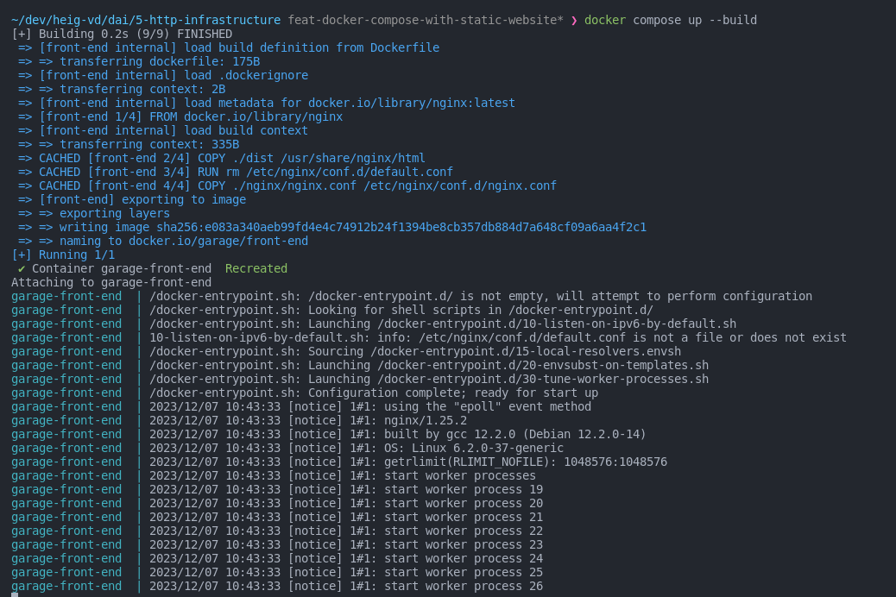
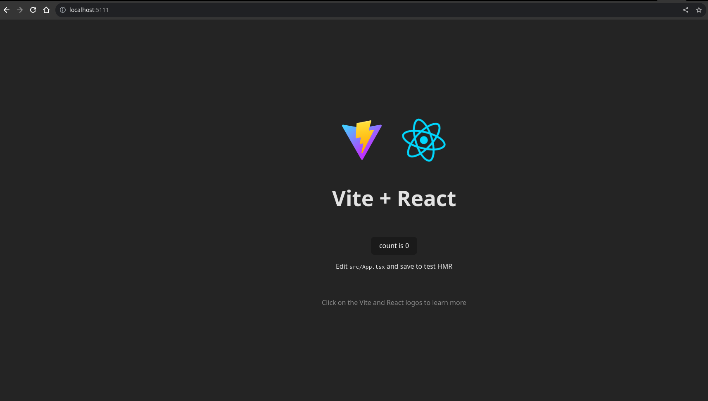

# dai-http-infrastructure

# Implementation

## Docker Compose

### FrontEnd

1. We start by defining the container-name and the image-name
2. For the building we can define a build directive, we set our context to the frontend folder and indicate the name of the dockerfile
3. Last but not least, we define the ports so that we can see the browser. This step is provisory, at the end of our implementation, we'll use the docker compose network directly and there won't be a need to expose any ports.

# Result





### Reverse Proxy

For this project we use Traefik as our reverse proxy

#### Configuration Steps

1. Define a service in the docker-compose file with the traefik image. For this project, we use the v2.10
2. Traefik uses the `command` directive to initialize its infrastructure. Since we use docker, we need to use `--provides.docker` and if we want the Traefik dashboard we can also use the `--api.insecure=true` directive
3. We need to map one of the host ports to the traefiks's container port 80 so we can see the other services.
4. We can also map one of the host ports to traefiks's 's port 8080 if we want to have access to traefik's dashboard
5. At this point, the ports that were open for others services may be closed

## Vertical Scaling and Load Balancing

With traefik, this step is very easy. In the [docker compose file](compose.yml) we can setup the replicas directly using the replicas tag:

```docker compose
 backend:
   ...
    deploy:
      replicas: 3
    ...
```

We can also change this with the infrastructure running with:

```bash
docker compose up --scale <service_name>:<nb_of_instances>
```
