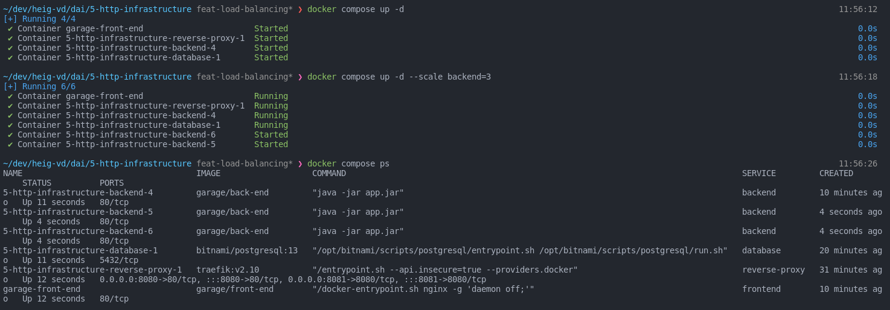
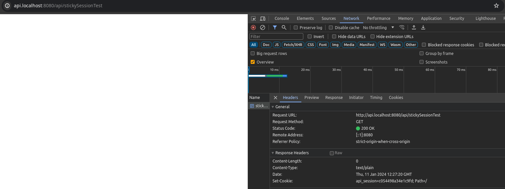
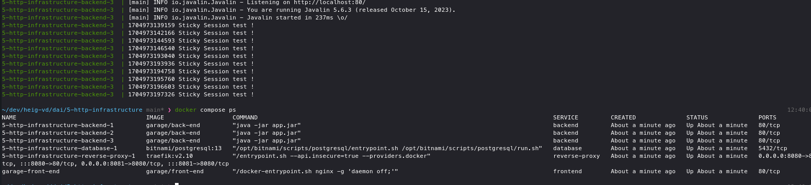
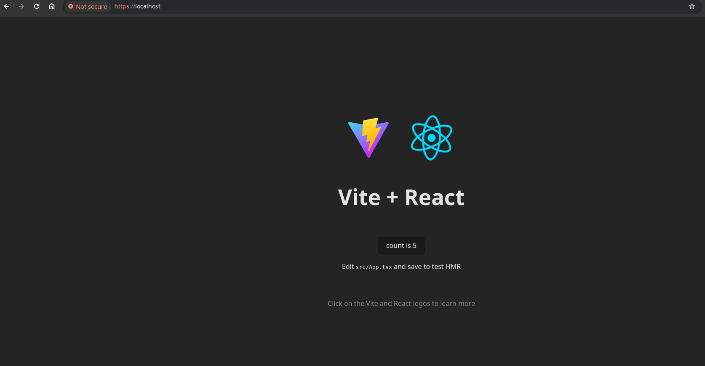

# dai-http-infrastructure

# Implementation

## Docker Compose

### FrontEnd

1. We start by defining the container-name and the image-name
2. For the building we can define a build directive, we set our context to the frontend folder and indicate the name of the dockerfile
3. Last but not least, we define the ports so that we can see the browser. This step is provisory, at the end of our implementation, we'll use the docker compose network directly and there won't be a need to expose any ports.

# Result


### Reverse Proxy

For this project we use Traefik as our reverse proxy

#### Configuration Steps

1. Define a service in the docker-compose file with the traefik image. For this project, we use the v2.10
2. Traefik uses the `command` directive to initialize its infrastructure. Since we use docker, we need to use `--provides.docker` and if we want the Traefik dashboard we can also use the `--api.insecure=true` directive
3. We need to map one of the host ports to the traefiks's container port 80 so we can see the other services.
4. We can also map one of the host ports to traefiks's 's port 8080 if we want to have access to traefik's dashboard
5. At this point, the ports that were open for others services may be closed

## Vertical Scaling and Load Balancing

With traefik, this step is very easy. In the [docker compose file](compose.yml) we can setup the replicas directly using the replicas tag:

```docker compose
#compose.yml
 backend:
   ...
    deploy:
      replicas: 3
    ...
```

We can also change this with the infrastructure running with:

```bash
docker compose up -d --scale <service_name>:<nb_of_instances>
```

### Checking everything is working

We can verify using:

```bash
docker compose ps
```



We can also check using the traefik's dashboard that we have the correct number of replicas:


## Sticky Session

### Configuration

Sticky session configuration can be done using labels

```docker compose
#compose.yml
  backend:
    ...
    labels:
      ...
      - "traefik.http.services.backend-service.loadBalancer.sticky.cookie=true"
      - "traefik.http.services.backend-service.loadBalancer.sticky.cookie.name=api_session"
```

After this is done the requests to our backend will get a 'Set-Cookie' header



And multiple requests will all be redirected to the same container instance



## HTTPS

The following steps were made to enable https

1. Generated ssl certificate and key based on this [stack overflow answer](https://stackoverflow.com/questions/10175812/how-to-generate-a-self-signed-ssl-certificate-using-openssl#10176685).

```bash
openssl req -x509 -newkey rsa:4096 -keyout key.pem -out cert.pem -sha256 -days 3650 -nodes -subj "/C=XX/ST=<StateName>/L=<CityName>/O=<CompanyName>/OU=<CompanySectionName>/CN=<CommonNameOrHostname>"
```

2. Generated a [traefik configuration file](./traefik/conf.yaml)

3. Mounted these new files to the traefik container

```docker compose
#compose.yml
reverse-proxy:
    image: traefik:v2.10
    volumes:
      - /var/run/docker.sock:/var/run/docker.sock
      - ./ssl:/etc/traefik/certificates # cert.pem and key.pem
      - ./traefik/conf.yaml:/etc/traefik/traefik.yaml # traefik config file
    ...
```

4. Enabled tls in the backend and frontend using lables

```docker compose
#compose.yml
  backend:
    ...
    labels:
      ...
      - "traefik.http.routers.backend.tls=true"
  frontend:
      ...
      labels:
        ...
        - "traefik.http.routers.frontend.tls=true"
```

We can now connect using https.



Note: The browser warns us because the certificate is self signed
