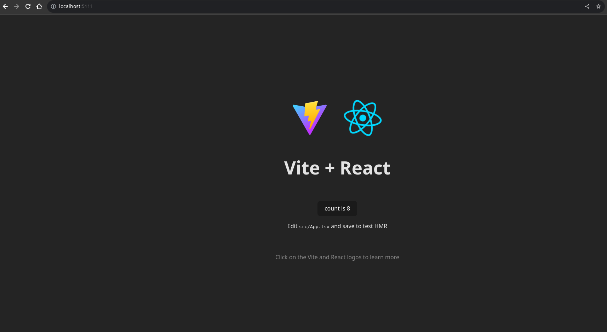

# Front end

- For this project, we'll create a simple react-app using vite

- The setup process is really easy

## React

Node version used v20.6.1
Npm version used 9.8.1

Step 1) Create the vite app and follow the instructions

```bash
npm create vite@latest
```

We setup a react project using type-script

Step 2) Install dependencies

```bash
cd garage-frontend
npm install
```

## Nginx

Step 3) Create the nginx config

We need to tell nginx 2 things:

1. The port to listen to (Port 80 in our case)

2. Where to find the our compiled react project

```nginx
server {
    listen       80;
    root   /usr/share/nginx/html;
}
```

## Docker

Step 3) Create the Docker file

The file has to:

1. Use nginx as its base image
2. Copy the nginx config file
3. Copy the dist folder that contains our html, css and js
4. Remove the default config file

```Dockerfile
FROM nginx

COPY ./dist /usr/share/nginx/html
RUN rm /etc/nginx/conf.d/default.conf
COPY ./nginx/nginx.conf /etc/nginx/conf.d/nginx.conf
```

## Building and deploying

```bash
npm run build
docker build . -t garage/front-end
docker run -p 5111:80 garage/front-end
```

## Result



## Api Interface

In this project we use the [axios](https://github.com/axios/axios) library to make http requests to our backend

To setup axios to communicate with our backend we setup two axios clients:

```typescript
//api-client.ts
import axios from "axios";

//calculate the apiDomain
export function apiDomain() {
  const { hostname } = window.location;
  return `https://${hostname}/api`;
}

//apiClient used in our app
export default axios.create({
  baseURL: apiDomain(),
  headers: {
    "Content-Type": "application/json",
  },
});

//mediaApiClient used to upload images
export const mediaApiClient = axios.create({
  baseURL: apiDomain(),
  responseType: "blob",
  headers: { "Content-Type": "multipart/form-data" },
});
```

We have two clients, one to handle files and another one to handle json data.

To make a GET request (using [react hooks](https://react.dev/reference/react/hooks)) we created a generic hook

```typescript
//useData.ts
const useData = <T>(
  apiEndPoint: string,
  requestConfig?: AxiosRequestConfig,
  deps?: any[]
) => {
  const [data, setData] = useState<T>();
  const [statusCode, setstatusCode] = useState(-1);
  const [isLoading, setLoading] = useState(false);

  useEffect(
    () => {
      const controller = new AbortController();
      setLoading(true);
      apiClient // <- the GET REQUEST
        .get<T>(apiEndPoint, {
          signal: controller.signal,
          ...requestConfig,
        })
        .then((res) => {
          setData(res.data);
          setLoading(false);
          setstatusCode(res.status);
        })
        .catch((err) => {
          if (err instanceof CanceledError) {
            return;
          }
          setData(undefined);
          setstatusCode(err.response.status);
          setLoading(false);
        });

      return () => controller.abort();
    },
    deps ? [...deps] : []
  );

  return { data, setData, statusCode, isLoading };
};

export default useData;
```

This hook does abit more than just a GET request but we can see the usage of apiClient.get().

Other http methods are used inside a generic class

```typescript
//http-service.ts
export interface Entity {
  id: number;
}

export class HttpService {
  endpoint: string;

  constructor(endpoint: string) {
    this.endpoint = endpoint;
  }
  get<T>(params: T, config: AxiosRequestConfig) {
    return apiClient.get(this.endpoint, { ...config, params: params });
  }
  getMedia(id: string, config: AxiosRequestConfig) {
    return mediaApiClient.get(this.endpoint, { ...config, params: { id: id } });
  }
  delete(id: string | number, config?: AxiosRequestConfig) {
    return apiClient.delete(this.endpoint + `/${id}`, {
      ...config,
      params: { id: id },
    });
  }
  deleteCompositeKey(params: object, config: AxiosRequestConfig) {
    return apiClient.delete(this.endpoint, { ...config, params: params });
  }
  post<T>(entity: T, config?: AxiosRequestConfig) {
    return apiClient.post(this.endpoint, entity, config);
  }
  postMedia(data: FormData, config?: AxiosRequestConfig) {
    return mediaApiClient.post(this.endpoint, data, config);
  }
  update<T extends Entity>(entity: T, config?: AxiosRequestConfig) {
    return apiClient.patch(this.endpoint, entity, {
      ...config,
    });
  }
}

const create = (endpoint: string) => new HttpService(endpoint);
```

Here we can see the usage of GET, POST, PATCH and DELETE

With the hook useData and this class, we are now able to abstract away the http requests

```typescript
//useServices.ts

//fetchs all services from backend
const useServices = () => useData<Service[]>("/services");

//useServices usage example
//
// data is the data returned by our http
// isLoading indicates that the request is loading
// statusCode indicates the http status code of the request
//
const { data, isLoading, statusCode } = useServices();

//If we have data, map it and do stuff with it...
data && data.map((service) => ...)
```

We also added the ability to send files. For this we use the apiMediaClient that sets the following headers:

```typescript
  responseType: "blob", // indicates axios that we'll be dealing with blob data
  headers: { "Content-Type": "multipart/form-data" }, //indicates the server what we are sending form-data
```

We can then use this client to send files like this...

```typescript
export function sendImages(service: Service, fileList: FileList | null) {
  if (!fileList) {
    return null;
  }
  var formData = new FormData();
  for (let i = 0; i < fileList.length; ++i) {
    formData.append(`image${i}`, fileList[i]);
  }
  return mediaApiClient.post(`/media/${service.id}`, formData);
}
```
